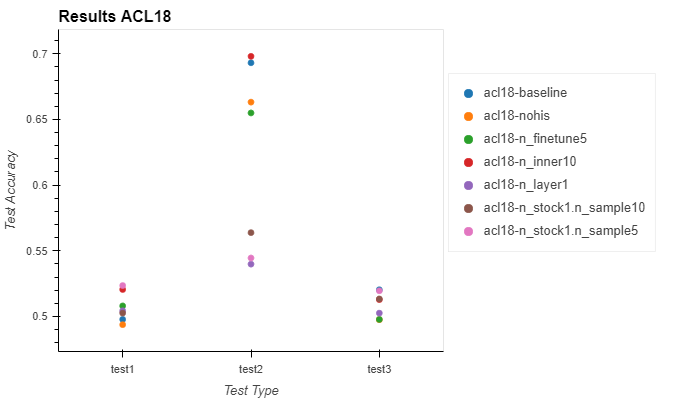
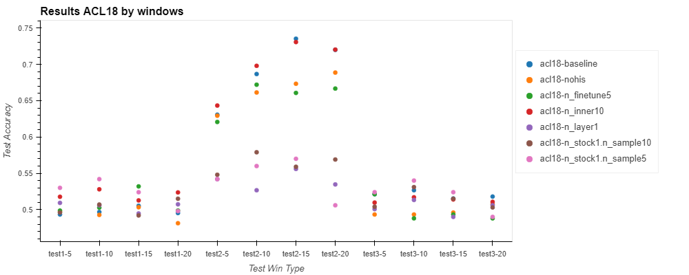
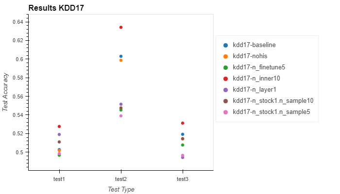
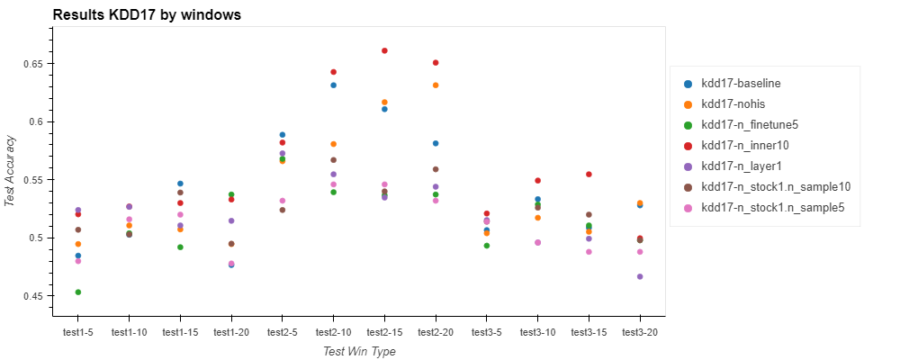

# Stock Movement predIction with Latent Embedding optimization

😊 SMILE - Stock Movement predIction with Latent Embedding optimization

## Prerequisite

For pipenv user

```bash
# this command will automatically generate lock file by your system
$ pipenv lock
# install the env
$ pipenv install
```

For other users

```bash
# window users
pip install -r requirements_win.txt
# other users
pip install -r requirements.txt
```

## How-to-Run

1. First write a experiment yaml file(see `settings.yml` in the `experiments` folder
    * There are also some pre-defined settings see the comments in the `settings.yml`
2. Run the experiments
    ```bash
    $ sh ./run_train.sh [your_exp_filename]
    # e.g.
    $ sh ./run_train.sh acl18.0
    ```

You can also run test on all the experiments by

```bash
$ sh ./run_test.sh [number of meta test for each iteration]
# e.g.
$ sh ./run_test.sh 100
```

## Experiment Results

### ACL18





### KDD17





### Table

| Experiment File | Experiment| Test Type| Test Accuracy| Test Loss| Train Accuracy| Train Loss|
| --- | --- |  --- |  --- |  --- |  --- |  --- | 
| acl18.0 | acl18-baseline| test1| 0.5118| 7.4329| 0.8633| 0.3078| 
| | | test2| 0.6877| 3.8232| | | 
| | | test3| 0.5135| 6.6364| | |
| acl18.1 | acl18-nohis_1| test1| 0.5113| 6.1526| 0.8933| 0.2813| 
| | | test2| 0.6567| 4.0848| | |
| | | test3| 0.5148| 6.1174| | |
| acl18.2 | acl18-n_finetune5| test1| 0.5168| 6.2921| 0.8350| 0.3608| 
| | | test2| 0.6402| 4.0439| | |
| | | test3| 0.4868| 6.3577| | |
| acl18.3 | acl18-n_layer1| test1| 0.5040| 6.0520| 0.8850| 0.2911| 
| | | test2| 0.5545| 4.9809| | |
| | | test3| 0.5008| 5.7756| | |
| acl18.4 | acl18-n_stock1.n_sample5| test1| 0.5095| 4.7025| 0.8100| 0.4778| 
| | | test2| 0.5390| 4.1183|  | |
| | | test3| 0.5170| 4.3116| | |
| acl18.5 | acl18-n_stock1.n_sample10| test1| 0.4810| 5.6018| 0.8475| 0.3668| 
| | | test2| 0.5423| 4.4572| | |
| | | test3| 0.5100| 5.0539| | |
| acl18.6 | acl18-n_inner10| test1| 0.5122| 8.8750| 0.8858| 0.2751| 
| | | test2| 0.7078| 4.4255| | |
| | | test3| 0.5123| 8.6040| | |
| kdd17.0 | kdd17-baseline| test1| 0.5127| 3.1997| 0.6550| 0.6209| 
| | | test2| 0.5958| 2.6747| | |
| | | test3| 0.5188| 3.2512| | |
| kdd17.1 | kdd17-nohis| test1| 0.5042| 3.2292| 0.6667| 0.6026| 
| | | test2| 0.5888| 2.8033|  | |
| | | test3| 0.5183| 3.1743| | |
| kdd17.2 | kdd17-n_finetune5| test1| 0.5145| 3.1745| 0.6767| 0.6149| 
| | | test2| 0.5448| 3.0430| | |
| | | test3| 0.5108| 3.2819| | | 
| kdd17.3 | kdd17-n_layer1| test1| 0.5063| 3.4224| 0.6650| 0.6271| 
| | | test2| 0.5532| 3.3240| | |
| | | test3| 0.5110| 3.3782| | |
| kdd17.4 | kdd17-n_stock1.n_sample5| test1| 0.4865| 3.1318| 0.6700| 0.6482| 
| | | test2| 0.5360| 3.0204| | | 
| | | test3| 0.4980| 3.0609| | | 
| kdd17.5|kdd17-n_stock1.n_sample10|test1|0.5110|3.1398|0.6500|0.6657|
| | | test2| 0.5475| 3.0745| | |
| | | test3| 0.5145| 3.1941| | |
| kdd17.6 | kdd17-n_inner10| test1| 0.5195| 3.4049| 0.6658| 0.6209| 
| | | test2| 0.6364| 2.6134|  | |
| | | test3| 0.5288| 3.4379| | |
